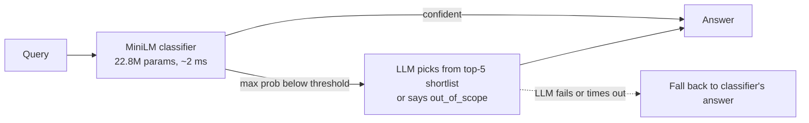

# loopthink

**When can a small model make the decision, and when does it need an LLM?**

A 22.8M-parameter classifier answers most queries in about 2 ms and hands the uncertain ones to an LLM
with a shortlist of its top guesses. On two public intent benchmarks it is at least as accurate as the
LLM on its own, at 4–7× lower latency and 7–22× lower cost depending on the configuration, with about
14% of queries reaching the LLM.

I also tested five ideas for improving that design. One helped: showing the LLM a few training examples
for each shortlisted label. The other four did not beat the simple version, and those negative results
are reported here in full, because they are the more useful half of the project.



## Headline results

Accuracy is system accuracy with 5% of traffic being requests the system was never built for.
Brackets are 95% bootstrap confidence intervals. The escalation threshold is set on in-scope validation
data only, so no unknown queries are seen before testing.

| Benchmark | Classifier alone | **Classifier + LLM** | LLM alone | Sent to LLM | Mean latency (cascade / LLM alone) | Cost per 1k queries |
|---|---|---|---|---|---|---|
| CLINC150, far out-of-scope · qwen2.5 7B | 91.1% | **93.6%** [92.9–94.4] | 78.7% [71.8–85.0] | 14.7% | 71 / 455 ms | $0.004 / $0.099 |
| CLINC150, far out-of-scope · qwen2.5 7B **+ examples** | 91.1% | **95.2%** [94.6–95.9] | 78.7% [71.8–85.0] | 14.7% | 113 / 455 ms | $0.012 / $0.099 |
| HWU64, far out-of-scope · qwen2.5 7B | 87.0% | **87.9%** [86.2–89.4] | 72.1% [65.2–78.8] | 14.1% | 71 / 465 ms | $0.004 / $0.062 |
| HWU64, held-out intents · qwen2.5 7B | 87.5% | **88.5%** [86.8–90.4] | 81.5% [75.8–87.1] | 13.5% | 66 / 449 ms | $0.008 / $0.062 |
| HWU64, held-out intents · qwen2.5 7B **+ examples** | 87.5% | **89.8%** [88.0–91.6] | 81.5% [75.8–87.1] | 13.5% | 98 / 449 ms | $0.009 / $0.062 |
| HWU64, held-out intents · gpt-oss 120B | 87.5% | **89.7%** [87.8–91.4] | 84.6% [78.6–89.9] | 13.5% | 109 / 771 ms | $0.018 / $0.132 |

"+ examples" means each shortlisted label is shown to the LLM with its three most similar training
examples. Rows without it give the LLM label names only.

What these numbers do and do not show:

- **Against a local 7B model the cascade is clearly more accurate.** Against a 120B model the gap is about
  5 points and the confidence intervals overlap, so the claim is "at least as accurate, much cheaper and
  faster", not "more accurate".
- **The small classifier does most of the work.** Given label names only, the LLM adds 1–2.5 points on
  top of the classifier alone; given examples, 2.3–4.1 points. A 22.8M model fine-tuned for two minutes
  scores about the same as a 120B model on this task.
- **Examples matter more than model size.** A local 7B with examples (89.8%) matches a 120B without them
  (89.7%) on HWU64 held-out intents. On CLINC150 the gain from examples is outside the confidence
  intervals; on HWU64 it is 1.9 points with overlapping intervals.
- **The advantage shrinks as unknown traffic grows.** At 18% unknown queries on HWU64 held-out intents the
  cascade and the 120B alone are level (84.4% vs 84.5%). The design pays off when most traffic is routine.
- Cost is priced at reference API rates for the tokens actually used ($0.15 / $0.60 per 1M input /
  output tokens). The local LLM itself is free to run.

Full tables, seed variance and the sensitivity to unknown-traffic share are in
[results/REPORT.md](results/REPORT.md). Intervals come from bootstrap resampling, so re-running
`scripts/report.py` can move an interval endpoint by about 0.1.

## Six ideas, two survivors

| Idea | Result | Evidence |
|---|---|---|
| **Small classifier + confidence threshold + top-5 shortlist to an LLM** | **Works** | Table above |
| Looped transformer: use "did the answer settle?" as the uncertainty signal | No gain. After pretraining the model answers in one pass; convergence scores 0.52–0.57 AUROC against 0.90–0.94 for plain max-softmax | [Looped model](#the-looped-model-the-original-idea) |
| A much larger fallback LLM (7B → 120B) | +1.2 points. The queries the classifier is unsure about are hard for every model: 42% correct for the 7B, 47–49% for the 120B | REPORT.md §3 |
| **Showing the LLM three training examples for each shortlisted label** | **Works.** On the hard queries the LLM goes from 53% to 69% correct (CLINC150) and from 42% to 57% (HWU64 held-out). System accuracy 93.6% → 95.2% and 87.9% → 89.8%. Costs 2–3× more per escalated call, because the prompt is longer | REPORT.md §3, rows marked "+ examples" |
| Conformal prediction sets for routing and for the shortlist | The coverage guarantee holds (95.0% measured at a 95% target), but the router is not better than a threshold at the same LLM budget, and 6–66% of unknown queries still get a confident wrong label | [results/CONFORMAL.md](results/CONFORMAL.md) |
| Contrastive decision model with a trained "none of these" | Behind the fine-tuned classifier at spotting unknown intents (AUROC 0.903 vs 0.923 on CLINC150, 0.853 vs 0.879 on HWU64). Fine-tuning the backbone, not the contrastive design, is what helps | [results/CLM_KILLTEST.md](results/CLM_KILLTEST.md) |

The pattern across all of these: on intent routing, a fine-tuned small classifier with a plain confidence
threshold is a very strong baseline, and what improves the fallback is telling the LLM what each label
means, not making the LLM bigger. The open problem the data points at is detecting requests that are
*close to* a known intent but not one of them (AUROC 0.87–0.92, against 0.97 for unrelated requests).

## Classifier quality

Mean ± std over 3 seeds, with 95% bootstrap intervals pooled over seeds and test queries.

| Model | Dataset | Unknowns | In-scope accuracy | Unknown detection AUROC (energy) |
|---|---|---|---|---|
| MiniLM-L6 (22.8M) | CLINC150 | far out-of-scope | 95.9 ± 0.1% [95.3–96.5] | 0.973 ± 0.002 |
| MiniLM-L6 (22.8M) | CLINC150 | held-out intents | 96.6 ± 0.1% [96.0–97.1] | 0.923 ± 0.005 |
| MiniLM-L6 (22.8M) | HWU64 | far out-of-scope | 91.6 ± 0.2% [89.9–93.3] | 0.895 ± 0.002 |
| MiniLM-L6 (22.8M) | HWU64 | held-out intents | 92.1 ± 0.1% [90.1–93.9] | 0.879 ± 0.007 |
| Looped transformer (28.8M, trained from scratch) | CLINC150 | far out-of-scope | 93.8% [93.1–94.5] | 0.947 |
| Looped transformer (28.8M, trained from scratch) | CLINC150 | held-out intents | 94.5% [93.8–95.2] | 0.892 |

"Held-out intents" hides a quarter of each dataset's intents during training and treats them as unknown at
test time. It is the harder and more realistic test.

## The looped model (the original idea)

The project started as a 28.8M looped (recurrent-depth) transformer, pretrained from scratch on 200M tokens
of FineWeb-Edu on a laptop, then fine-tuned on CLINC150. The hypothesis was that a query whose answer never
settles across loops is one the model does not know.

It did not hold. After pretraining the model reaches its final answer at loop 1, and accuracy is identical
from 1 to 32 loops. Three deep-supervision settings gave the same outcome. The model itself is respectable
for something trained from scratch (93.8% against MiniLM's 95.9%, from roughly 5× less pretraining data),
but MiniLM is better and trains in two minutes, so MiniLM is what the router deploys.

Code: `loopthink/model.py`, `pretrain.py`, `finetune.py`, `evaluate.py`; `scripts/kill_test.py`.

## The API

```bash
python scripts/encoder_baseline.py --setup official --out runs/minilm_clinc_official_s0 --save_model
ROUTER_DIR=runs/minilm_clinc_official_s0 uvicorn serve.router_api:app --port 8000
# open http://localhost:8000            (console; operations view at /dashboard)
```

`POST /decide {"text": "..."}` returns the answer, confidence, the top-5 intents, whether it escalated, a
plain-English reason, timings, and which path answered:

| `source` | Meaning |
|---|---|
| `model` | The classifier was confident and answered |
| `llm` | Low confidence; the LLM picked from the shortlist or said `out_of_scope` |
| `model_fallback` | The LLM failed or timed out, so the classifier's answer is returned instead of an error |
| `model_no_llm` | The caller set `allow_llm: false` to cap cost or latency |

Every request is logged, and `/dashboard` shows escalation rate, out-of-scope rate, latency and LLM
failures. By default the LLM sees each shortlisted label with its three most similar training examples,
the best setup measured above (`EXAMPLES=0` sends label names only). A test checks that the served prompt
is the same one the offline measurement used. The fallback LLM is Ollama by default; `LLM_PROVIDER=openai|groq|openrouter|gemini` switches to a
hosted model. `Dockerfile.router` builds a container.

The root URL (`/`) is an interactive console: type a request and see which model answered, the route it took,
the timings and the prompt an escalated request sends. A session panel estimates time and cost against sending
every request to an LLM, and a slider changes the confidence threshold per request. `scripts/push_space.py`
publishes the same service as a Hugging Face Space.

## Reproduce

Tested on a MacBook Pro (Apple silicon, 16 GB). Python 3.11+.

```bash
pip install -r requirements.txt transformers
python -m pytest -q tests/                      # 21 tests

bash scripts/run_seeds.sh                       # MiniLM, 3 seeds × 2 datasets × 2 unknown types (~30 min)

ollama pull qwen2.5:7b                          # real LLM numbers (~15 min per run)
python scripts/llm_validate.py --run runs/minilm_clinc_official_s0 --model qwen2.5:7b --hint_topk 5
python scripts/llm_validate.py --run runs/minilm_clinc_official_s0 --model qwen2.5:7b

python scripts/report.py                        # results/REPORT.md
python scripts/conformal.py                     # results/CONFORMAL.md
python scripts/clm.py                           # results/CLM_KILLTEST.md
```

The looped model needs the 200M-token pretraining run first (about 10 hours on the same laptop); see
[docs/MAC.md](docs/MAC.md).

## Layout

```
loopthink/   router.py  llm.py                      decision logic, LLM fallback
             model.py  pretrain.py  finetune.py  evaluate.py  engine.py   looped transformer
serve/       router_api.py  console.html  (api.py: looped-model service)
demo/        app.py  (looped-model demo)
scripts/     encoder_baseline.py  cascade.py  llm_validate.py  report.py
             conformal.py  clm.py  kill_test.py  prepare_hwu64.py  run_seeds.sh
results/     REPORT.md  CONFORMAL.md  CLM_KILLTEST.md
tests/       test_router.py  test_core.py
```

## Limits

- Public academic benchmarks, not real user traffic.
- The share of unknown traffic (5%) is an assumption; REPORT.md shows 2%, 5%, 10% and 18%.
- LLM comparisons use one classifier seed and 150–300 sampled LLM calls per group, which is why their
  intervals are wide.
- The cascade pattern itself is established (FrugalGPT and later work). The contribution here is careful
  measurement, a working system, and the negative results.
- CLINC150 and HWU64 are used under their own licences; this repository does not redistribute them.

## Data

- CLINC150: Larson et al., *An Evaluation Dataset for Intent Classification and Out-of-Scope Prediction*, EMNLP 2019.
- HWU64: Liu et al., *Benchmarking Natural Language Understanding Services for Building Conversational Agents*, 2019.

## Licence

Code: [MIT](LICENSE). The datasets keep their own licences.
